# Guitar Hub

Guitar Hub is a fictional guitar website with a shop based in Kildare, Ireland that sells a range of electric, acoustic and bass guitars. There are a wide range of guitars to suit every level of musician, with finance plans in place and a thirty day money back guarantee. Other services available to our customers include custom paint jobs, a selection of tonewoods, a hardcase to protect your instrument when you spend seven hundred and fifty euro or more and free shipping when you spend eight hundred euros or more. 

insert photos on multiple devices

## Features

### Site wide

  * Navigation Menu
    * Contains the links to the Home, Electric, Acoustic, Bass and Gallery pages and will be responsive on all devices.
    * Users will be able to navigate easily between pages on different sized devices.
    * The links display a horizontal line underneath them when the cursor hovers over them.

  * Footer
    * This section of the website contains the social media, email and phone information. The social media icons are clickable and will bring the user to a new tab. These icons are accessible to visually impaired users by implementing the use of aria-labels.
    * The background of the social media icons become animated and change colour when the cursor hovers over them.
    * The phone number and email address become bold when hovered over.
    * When the phone number and email address are clicked they bring up a pop up box that allows the user to phone or email Guitar Hub.

  * Favicon
    * A site wide favicon will be implemented showing the Guitar Hub logo in the tab header allowing the website to be easily identified when a user has multiple tabs open

### Main Page

  * Landing Page 
    * This will display information regarding what the website is about and the services on offer.

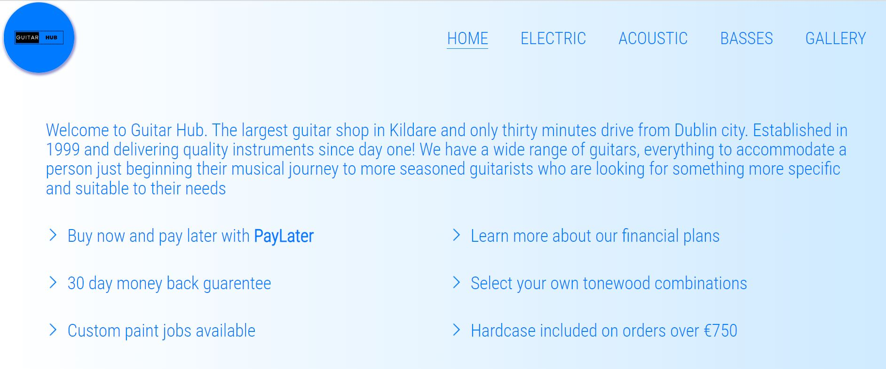
  
  * Page Info
    * This section of the main page is split between a description of what's on offer and a clickable button that takes the user to the electric guitar page. There's also a collage of guitars that are currently in stock.
    * There are a row of three boxes with three clickable buttons that take the user to either the acoustic/bass/gallery page.

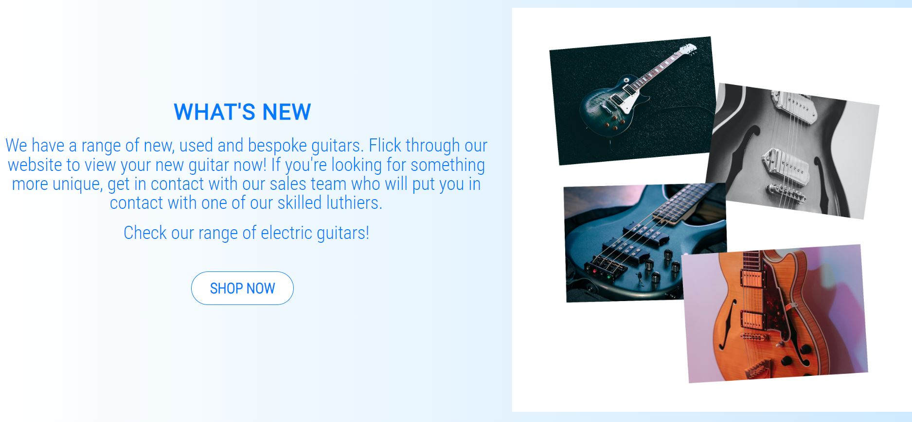

  * Contact Form
    * A contact form is available for customers. It consists of the following fields and attributes:
      ** Full Name (type=text, required)
      ** Email (type=email, required)
      ** Message (type=textarea)

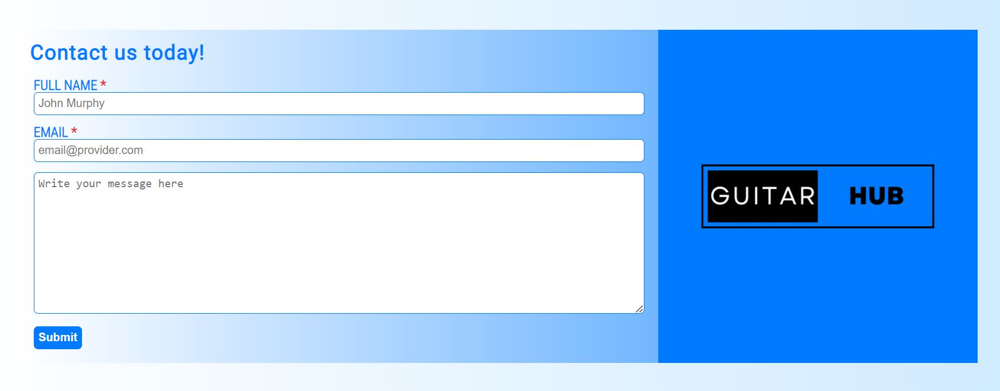

  * Submit Page

    * After submitting the form, the user will be redirected to a new page displaying a message saying your query has been successfully submitted and the time frame for which a staff memeber will answer it.
    * The user will see the above display as a typewriter effect on the page.
    * There is a link that allows the user to return to the main page.
    
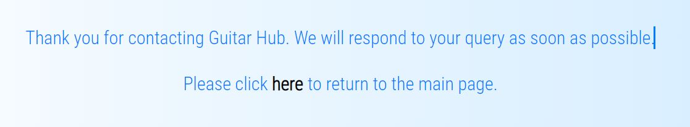
    
## Electric/Acoustic/Bass Guitar Pages

   * Contains two boxes that display information about the guitars on sale such as the price, colour and hardware specifications.
   * The boxes are responsive so all the information can be displayed on smaller devices
   
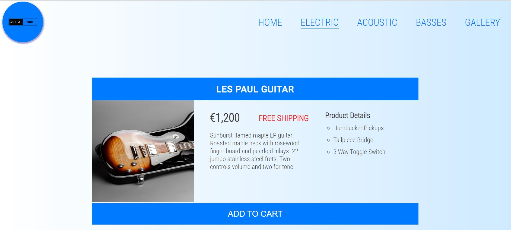
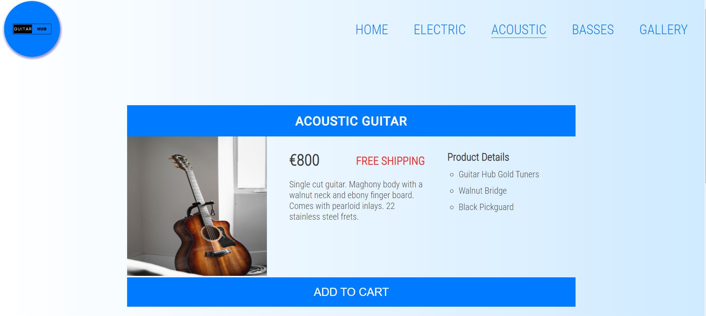
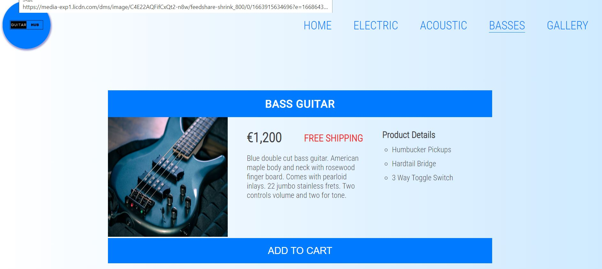

## Gallery Page

   * The gallery shows the customer what instruments are currently in stock.
   * The page is responsive so the gallery can be viewed on any decvice.
   * The pictures have an opacity setting on them when they're hovered over.

## Dessign

### Balsamiq

#### Home Page
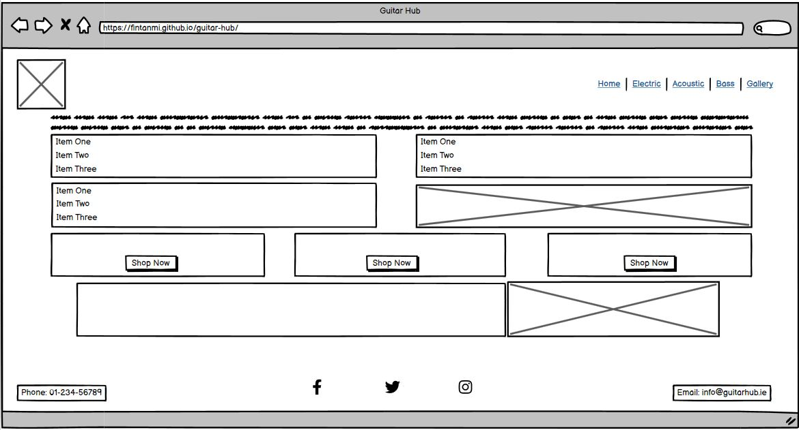
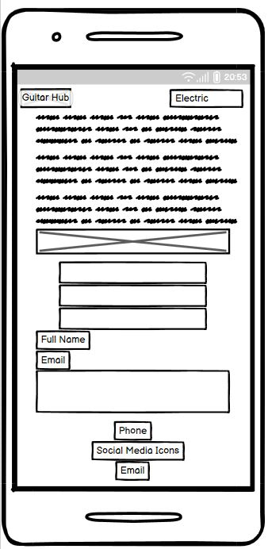

### Contact Form Submission Page
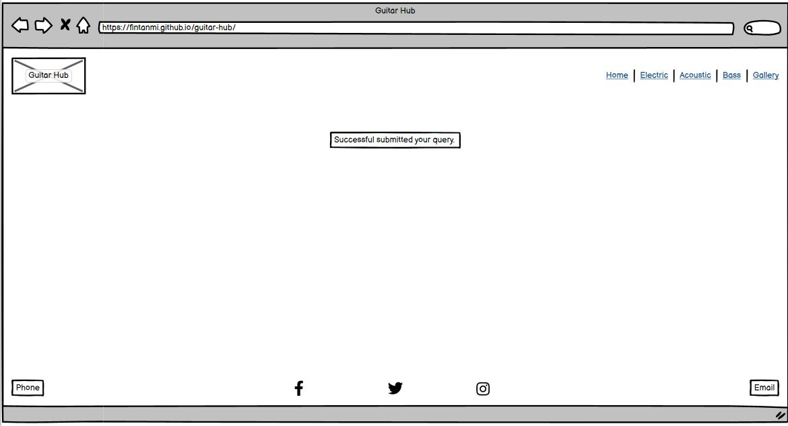
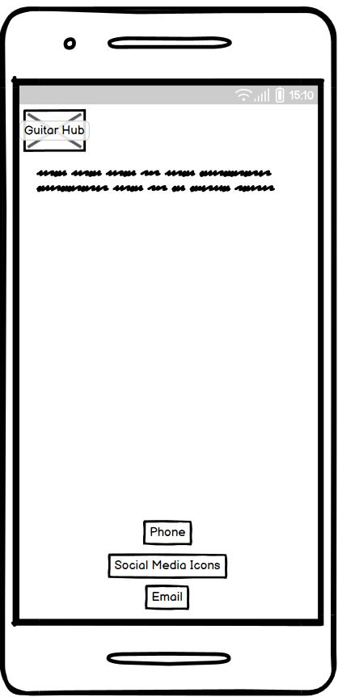

### Electric/Acoustic/Bass Pages
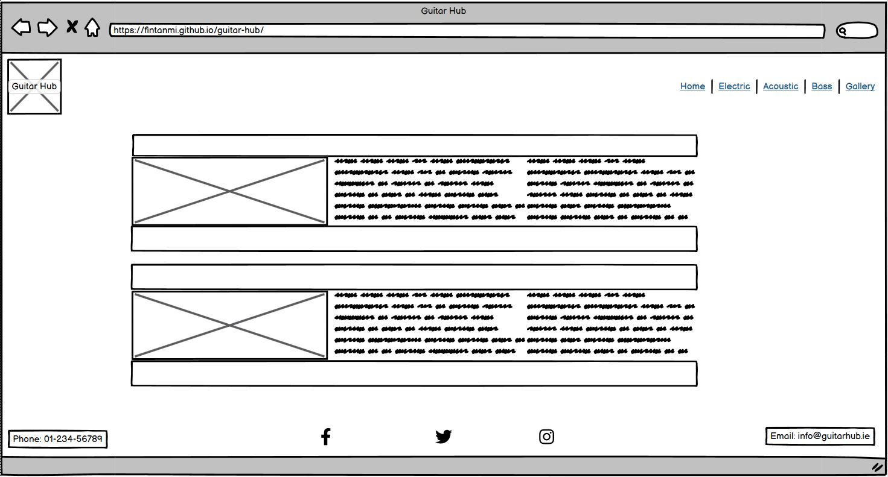
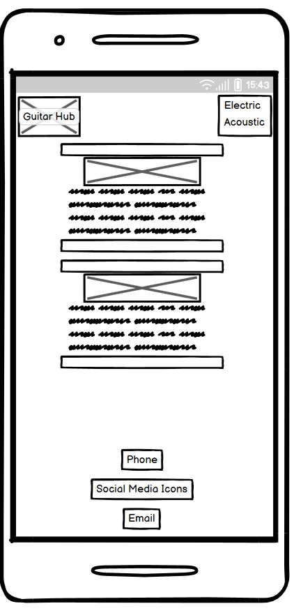

### Gallery Page
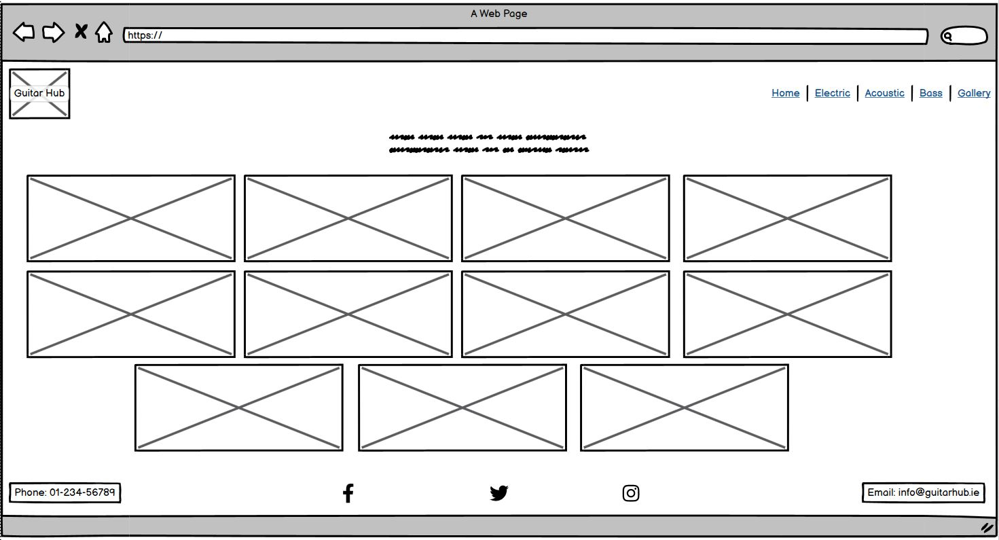
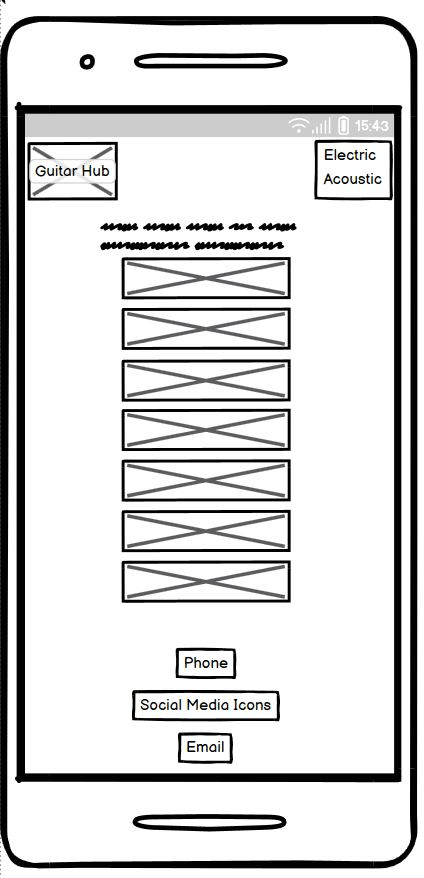

## Technologies

   *HTML - The structure of the website was built with HTML
   *CSS - The website was styled using CSS in a different file
   *Gitpod - Code for the project was written here
   *Github - Code is hosted on Github and deployed with Git
   *Git - Code was pushed to Github using Git commads
   *Font Awesome - Social media and arrow icons were obtained from https://fontawesome.com/
   *Favicon.io - The logo was created using this website https://https://favicon.io/
   *Balsamiq - The wireframe were developed using https://balsamiq.com/wireframes/desktop/
   
## Testing

### Responsiveness

All pages were tested to ensure responsiveness on screen sizes starting from desktop down to mobile.

Steps for testing Responsiveness:

 1. Open browser and navigate to [Guitar Hub](https://fintanmi.github.io/guitar-hub)
 2. Open the developer tools (right click and inspect)
 3. Set to responsive and steadily decrease width
 4. Set the zoom to 50%
 5. Click and drag the responsive window to mimimum width

Expected:

Website is responsive on all screen sizes and no images are pixelated or stretched. No horizontal scroll is present. No elements overlap.

Actual:

The website behaved as expected on large device screens. The contact form image began shrinking in a responsive way that made it look unappealing so it gets removed when the user is on a device of 900px wide and down. 

The website was viewed on:

 1. iPhone SE
 2. iPhone XR
 3. Pixel 5
 4. Samsung Galaxy S8+
 5. iPad Mini
 6. Surface Duo

### Accessibility

The website was manually tested throughout the build phase to ensure it is accessible to the visually impaired by including aria-labels, labels, alt descriptions. Lighthouse testing was completed on the desktop and mobile versions of the website the scores are displayed below:

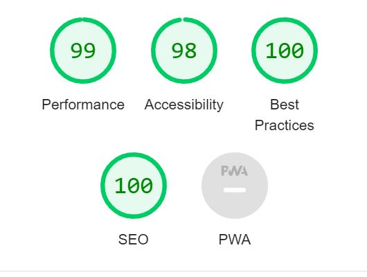
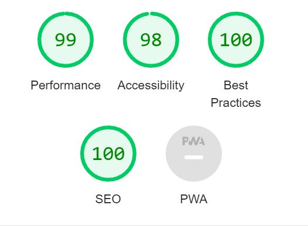

### Validation Testing

HTML code was passed through the following validator https://validator.w3.org/ and received a passing score:

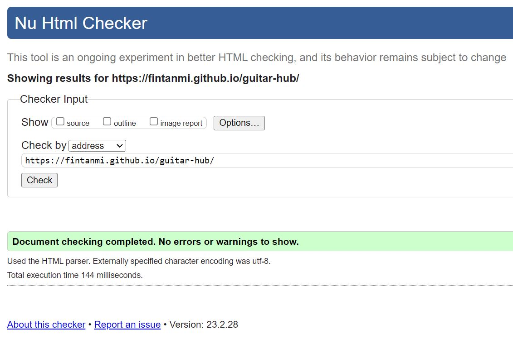

CSS code was passed through the jigsaw validator https://jigsaw.w3.org/css-validator/ and received a passing score:

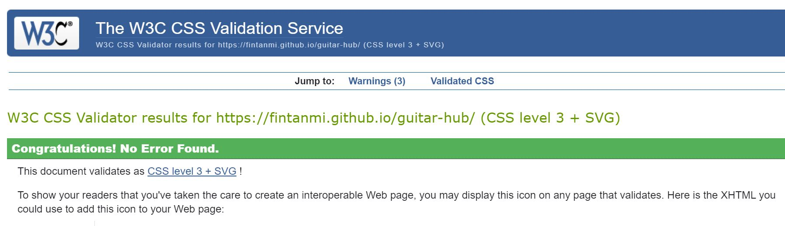

### Functional Testing

**Navigation Links**
    
To ensure each navigation link on every page was set up correctly, they were manually clicked to see how they performed
    
| Navigation Link | Expected Page |
| --------------- | ------------- |
| Home            | index.html    |
| Electric        | electric.html |
| Acoustic        | acoustic.html |
| Basses          | bass.html     |
| Gallery         | gallery.html  |
    
Links loaded as expected.
    
**Contact Form**
    
The contact form at the bottom of the home page was checked to ensure it functioned correctly. It can only be submitted when all required fields, denoted by a red asterisk, are entered. This will bring the user to the submitted page. If a user attempts to contact Guitar Hub, by clicking Submit, without entering their full name and email, they will be prompted to enter one or both of the missing fields. The typewriter animation effect was created by manipulating code from Temitope Oyedele on blog.logrocket.com.

**Footer**

The Font Awesome social media links were checked to ensure they brought the user to a new page when clicked. When the cursor hovers over each link there is an animation effect that was modified from the Udemy course 'Advanced CSS and Sass: Flexbox, Grid, Animations and More!' by Jonas Schmedtmann. The phone and email contact information go bold when the cursor hovers over them. When the phone number is clicked, a pop up box appears asking the user which device they would like to contact Guitar Hub on. Similarly, when the email address is clicked, a different pop up box appears asking what application you would like to send a mail from or your default email application is opened. 

Manual testing showed these icons and contact information behaved as expected.

**Unfixed Bugs**

The typewriter animation doesn't dynamically respond when viewed on devices around 400px and below. This will be fixed in a future release.

## Deployment

### Version Control

The site was created using gitpod and pushed to github to the remote repository ‘guitar hub’.
